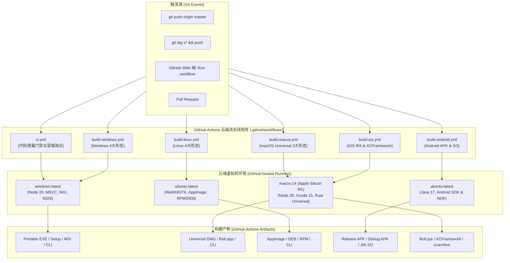

# Bolt GitHub Actions 自动化构建与安装包打包全指南

> 本文档详细介绍 Bolt 项目在 GitHub Actions 上的持续集成（CI）与全平台（Windows / macOS / Linux / Android / iOS）云端自动化打包发布配置体系，指导开发者如何配置、手动/自动触发构建、以及如何下载并安装各平台产物。

---

## 1. 架构总览与流水线矩阵

Bolt 采用统一的 Rust 传输引擎 + 跨端外壳架构。为了让没有全部五端物理设备（尤其是缺乏 Mac 电脑或 Linux 主机）的开发者也能一键获得各平台的原生可执行文件与安装包，项目在 `.github/workflows/` 下维护了完整的 GitHub Actions 流水线矩阵：



### 流水线全矩阵清单

| 流水线文件 | 目标平台 | 云端 Runner | 依赖工具链与环境 | 最终输出产物 Artifacts |
| :--- | :--- | :--- | :--- | :--- |
| [`.github/workflows/ci.yml`](file:///e:/AIProjects/bolt/.github/workflows/ci.yml) | 核心门禁 | `windows-latest` | Rust stable, rustfmt, clippy, NDK r26d | `smoke-logs` (仅失败时), `android-jniLibs` |
| [`.github/workflows/build-windows.yml`](file:///e:/AIProjects/bolt/.github/workflows/build-windows.yml) | **Windows** 桌面端 | `windows-latest` | Node.js 20, Rust MSVC, WiX, NSIS | `bolt-windows-portable`, `bolt-windows-setup`, `bolt-windows-msi`, `bolt-windows-cli`, `bolt-windows-dist` |
| [`.github/workflows/build-macos.yml`](file:///e:/AIProjects/bolt/.github/workflows/build-macos.yml) | **macOS** 桌面端 | `macos-14` (ARM64) | Node.js 20, Rust Universal targets, lipo | `bolt-macos-dmg`, `bolt-macos-app`, `bolt-macos-cli`, `bolt-macos-dist` |
| [`.github/workflows/build-linux.yml`](file:///e:/AIProjects/bolt/.github/workflows/build-linux.yml) | **Linux** 桌面端 | `ubuntu-latest` | Node.js 20, WebKit2GTK, patchelf, rpm | `bolt-linux-dist` (包含 AppImage, DEB, RPM, CLI) |
| [`.github/workflows/build-android.yml`](file:///e:/AIProjects/bolt/.github/workflows/build-android.yml) | **Android** 移动端 | `ubuntu-latest` | Java 17, Android SDK, NDK r26+, cargo-ndk | `bolt-android-release-apk`, `bolt-android-debug-apk`, `bolt-android-jniLibs`, `bolt-android-dist` |
| [`.github/workflows/build-ios.yml`](file:///e:/AIProjects/bolt/.github/workflows/build-ios.yml) | **iOS** 移动端 | `macos-14` (ARM64) | Xcode 15+, iOS SDK, Rust iOS targets | `bolt-ios-ipa`, `bolt-engine-xcframework`, `bolt-ios-xcarchive` |

---

## 2. 触发机制与操作指南

所有打包流水线均支持三种触发维度，满足从日常开发到正式发版的各类场景：

### 2.1 触发维度

1. **自动推送触发 (`push`)**：
   - 推送至 `main` 或 `master` 分支时自动触发全平台构建，确保最新提交永远有对应可用产物。
2. **版本标签发布 (`tags`)**：
   - 当推送符合 `v*` 格式的 Git Tag 时触发（例如 `v0.1.0`、`v1.0.0-rc1`）。
3. **网页端手动即时触发 (`workflow_dispatch`)**：
   - 开发者无需修改任何代码，可在 GitHub 仓库网页端随时一键按需触发任意指定平台打包。

---

### 2.2 网页端手动触发步骤（图文指引）

当您需要临时打包某一平台（例如只需要 macOS 的 DMG 或 Android 的 APK）时，推荐使用手动触发：

1. 打开 GitHub 上的 Bolt 仓库主页；
2. 点击顶部导航栏的 **「Actions」** 页签；
3. 在左侧列表中点击您想要构建的工作流名称（如 `Build macOS Dist` 或 `Build Android Dist`）；
4. 在右侧上方会出现一个蓝色提示条 **「Run workflow」**，点击下拉菜单；
5. 选择目标分支（默认 `master`），然后点击绿色的 **「Run workflow」** 按钮；
6. 页面刷新后即可看到流水线开始排队并运行。

> [!TIP]
> 编译时长参考：
> - **Windows**：约 3 ~ 5 分钟
> - **Linux**：约 2 ~ 4 分钟
> - **macOS**：约 4 ~ 6 分钟（构建双架构 Universal 二进制）
> - **Android**：约 2 ~ 3 分钟
> - **iOS**：约 3 ~ 5 分钟

---

### 2.3 通过 Git 标签发布触发

如果准备发布新版本，只需在本地仓库打标签并推送：

```bash
# 1. 确认当前分支与最新代码
git checkout master
git pull origin master

# 2. 创建语义化版本标签 (例如 v0.1.0)
git tag -a v0.1.0 -m "Release v0.1.0: Full platform P2P file transfer support"

# 3. 推送标签到 GitHub 远端
git push origin v0.1.0
```

推送后，GitHub 会同时并行启动全平台 5 大构建任务。

---

## 3. 各平台详细配置文件解析

### 3.1 Windows 构建流水线 (`build-windows.yml`)

- **文件路径**：[`.github/workflows/build-windows.yml`](file:///e:/AIProjects/bolt/.github/workflows/build-windows.yml)
- **核心逻辑**：
  1. 使用 `actions/setup-node@v4` 缓存并安装前端依赖；
  2. 使用 `dtolnay/rust-toolchain@stable` 准备 MSVC Rust 编译环境；
  3. 执行 `scripts/build_windows_dist.ps1 -Mode release`，全自动生成四类形态：
     - **Portable**：绿色免安装可执行程序；
     - **NSIS**：经典桌面安装向导；
     - **WiX MSI**：企业级静默部署安装包；
     - **CLI**：终端命令行调试工具。
  4. 使用 `actions/upload-artifact@v4` 分别上传单一独立产物与完整压缩包。

### 3.2 macOS 构建流水线 (`build-macos.yml`)

- **文件路径**：[`.github/workflows/build-macos.yml`](file:///e:/AIProjects/bolt/.github/workflows/build-macos.yml)
- **核心逻辑**：
  1. 运行于 Apple 原生 M 系列虚拟机 `macos-14`；
  2. 同时安装 `aarch64-apple-darwin` 与 `x86_64-apple-darwin` 目标；
  3. 调用 `scripts/build_macos_dist.sh -m release -t universal-apple-darwin`；
  4. 通过 `lipo` 与 Tauri Universal 打包机制，编译出原生支持 Apple Silicon（M1/M2/M3/M4）与 Intel Mac 的双架构通用安装包：
     - `.dmg` 拖拽式安装镜像；
     - `.app` 应用程序目录与 `.app.zip` 分发包；
     - `-cli` 通用控制台二进制。

### 3.3 Linux 构建流水线 (`build-linux.yml`)

- **文件路径**：[`.github/workflows/build-linux.yml`](file:///e:/AIProjects/bolt/.github/workflows/build-linux.yml)
- **核心逻辑**：
  1. 在 `ubuntu-latest` 容器上安装 `libwebkit2gtk-4.1-dev`、`libgtk-3-dev`、`libayatana-appindicator3-dev`、`patchelf` 与 `rpm` 打包工具；
  2. 调用 `scripts/build_linux_dist.sh -m release`；
  3. 归档出主流 Linux 发行版的全套格式（AppImage / DEB / RPM / CLI）。

### 3.4 Android 构建流水线 (`build-android.yml`)

- **文件路径**：[`.github/workflows/build-android.yml`](file:///e:/AIProjects/bolt/.github/workflows/build-android.yml)
- **核心逻辑**：
  1. 配置 Temurin JDK 17 与 Gradle 缓存；
  2. 配置 Android NDK，安装 `cargo-ndk`；
  3. 编译 `arm64-v8a`、`armeabi-v7a`、`x86_64` 三套架构的 `libbt_ffi.so`；
  4. 调用 Gradle 执行 R8 混淆压缩与通用打包，生成经过深度优化的 Release APK 与包含堆栈的 Debug APK。

### 3.5 iOS 构建流水线 (`build-ios.yml`)

- **文件路径**：[`.github/workflows/build-ios.yml`](file:///e:/AIProjects/bolt/.github/workflows/build-ios.yml)
- **核心逻辑**：
  1. 在 `macos-14` 环境中跨编译真机（`aarch64-apple-ios`）与模拟器（`aarch64-apple-ios-sim` / `x86_64-apple-ios`）底层静态库；
  2. 打包生成 `BoltEngine.xcframework`；
  3. 调用 `xcodebuild archive` 编译 SwiftUI 原生工程；
  4. 产出免越狱侧载直接可装的 `Bolt.ipa` 以及 Xcode 归档 `Bolt.xcarchive`。

---

## 4. 如何下载与安装构建好的软件包

流水线构建完成后，所有产物都会在 GitHub 上保存（默认保留 90 天），可按以下步骤直接下载安装：

### 4.1 下载产物文件

1. 打开 GitHub 仓库，点击 **「Actions」** 页签；
2. 在列表中找到最近一次带有绿色勾号 ✔️ 的成功构建记录并点击进入；
3. 滚动到页面底部的 **「Artifacts」** 区域；
4. 点击需要的文件即可下载对应 ZIP 压缩包：
   - `bolt-windows-portable` / `bolt-windows-setup`
   - `bolt-macos-dmg` / `bolt-macos-app`
   - `bolt-linux-dist`
   - `bolt-android-release-apk`
   - `bolt-ios-ipa`

---

### 4.2 各平台安装与使用步骤

#### 🪟 Windows 端
- **便携版 (`bolt_0.1.0_x64-portable.exe`)**：解压后直接双击即可启动，无需安装，不向系统注册表或开机项写入多余内容。
- **向导安装版 (`bolt_0.1.0_x64-setup.exe`)**：双击运行向导，可自定义安装路径并自动创建桌面图标和开始菜单快捷方式。
- **防火墙配置**：首次运行如弹出 Windows Defender 防火墙拦截提示，请务必勾选 **「专用网络（局域网）」** 并点击允许。

#### 🍏 macOS 端
1. 解压下载的 `bolt-macos-dmg.zip`，双击挂载其中的 `bolt_0.1.0_universal.dmg`；
2. 将 **Bolt** 图标直接拖拽至 **Applications (应用程序)** 快捷方式文件夹即可完成安装；
3. **初次打开安全提示**：由于开源软件未购买商业苹果开发者公证证书，首次启动可能会提示“无法打开，因为来自无法确认的开发者”：
   - 解决方法 1：在访达（Finder）的「应用程序」中找到 Bolt，**按住 Control 键并点击图标**（或右键），选择 **「打开」**，在弹出警告框中点击 **「打开」** 即可。
   - 解决方法 2：前往「系统设置」→「隐私与安全性」，滚动到下方找到“已阻止使用 Bolt”，点击「仍要打开」。

#### 🐧 Linux 端
- **AppImage 单文件版**：
  ```bash
  unzip bolt-linux-dist.zip
  chmod +x dist/linux/release/appimage/bolt_0.1.0_amd64.AppImage
  ./dist/linux/release/appimage/bolt_0.1.0_amd64.AppImage
  ```
- **Debian / Ubuntu / Deepin / UOS 安装**：
  ```bash
  sudo dpkg -i dist/linux/release/deb/bolt_0.1.0_amd64.deb
  ```
- **Fedora / RHEL 安装**：
  ```bash
  sudo rpm -ivh dist/linux/release/rpm/bolt-0.1.0-1.x86_64.rpm
  ```

#### 📱 Android 端
1. 将下载的 `bolt_0.1.0_universal.apk` 传输至手机（或手机浏览器直接下载）；
2. 点击 APK 文件进行安装，根据系统提示开启“允许安装来自此来源的应用”；
3. 启动应用，授予局域网发现与必要存储权限即可使用。

#### 🍎 iOS 端
- **方式一：通过 AltStore / SideStore / TrollStore / Sideloadly 侧载安装**：
  1. 下载解压出 `Bolt.ipa`；
  2. 使用电脑上的 Sideloadly 或手机上的 TrollStore / AltStore，导入 `Bolt.ipa` 进行免费个人证书签名并安装到 iPhone/iPad；
  3. 前往 iOS「设置」→「通用」→「VPN 与设备管理」，信任您的个人证书即可运行。
- **方式二：Mac 开发者本地编译安装**：
  - 下载 `bolt-engine-xcframework` 放入 `ios_app/Frameworks/`，使用 Xcode 打开 `ios_app/Bolt.xcodeproj`，连接真机按 `⌘R` 运行。

---

## 5. 本地模拟与常见构建问题排查 (Troubleshooting)

### 常见问题 1：Windows 构建缺少 WiX 或 NSIS
- **表现**：`Tauri build failed: wix/nsis error`
- **排查**：本地需要安装 WiX Toolset 与 NSIS；但在 GitHub Actions 的 `windows-latest` 环境中，这些依赖均已由云端镜像默认预装。

### 常见问题 2：macOS Universal 构建缺少 Target
- **表现**：`error: target 'aarch64-apple-darwin' not found in toolchain`
- **排查**：本地构建 Universal 需要先添加双架构 Target：
  ```bash
  rustup target add aarch64-apple-darwin x86_64-apple-darwin
  ```

### 常见问题 3：Android NDK 路径未找到
- **表现**：`[错误] 未找到有效的 ANDROID_NDK_HOME`
- **排查**：检查环境变量 `ANDROID_NDK_HOME` 是否指向了具体版本目录（如 `.../ndk/26.1.10909125`）。`build_android_dist.sh` 和 `build_android_lib.ps1` 会自动在标准 SDK 路径下扫描最新 NDK。

### 常见问题 4：Artifacts 下载的压缩包中文件名带有乱码或过长
- **排查**：GitHub Actions 会自动对上级目录进行打包封装，建议直接解压至当前文件夹即可看到规整命名的产物。
