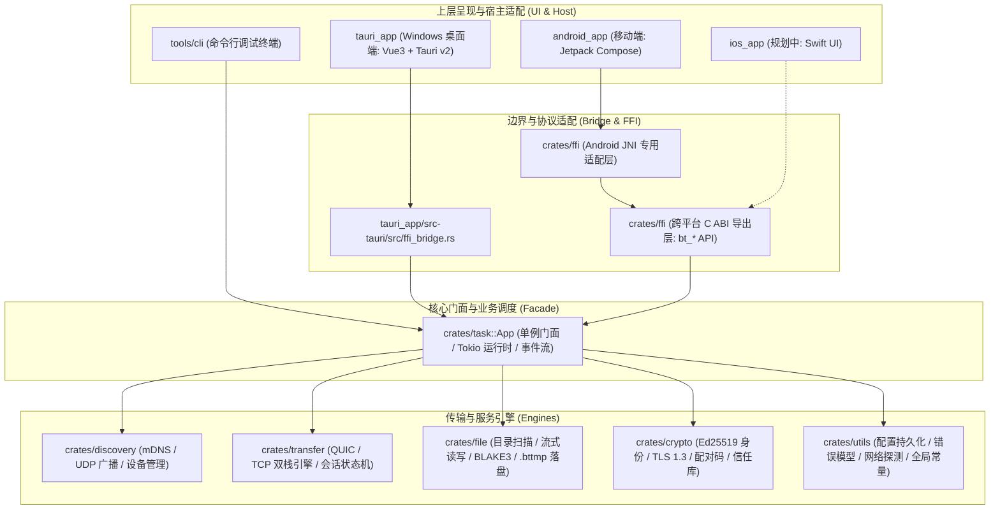

# Bolt 完整项目目录结构与架构指南

> 本文档精确对应 Bolt 代码库的实际组织结构、各模块源码划分、分层约束、构建脚本体系与最终发布产物归档规范。

---

## 目录树总览

```text
bolt/
├── Cargo.toml                                 # Cargo 工作区定义与全局优化 Profile 配置
├── Cargo.lock                                 # 依赖版本精确锁定文件
├── README.md                                  # 项目官方介绍与快速入门文档
├── .gitignore                                 # Git 版本管理忽略规则
│
├── crates/                                    # 【Rust 底层统一核心】(工作区核心成员)
│   ├── utils/                                 # 基础通用设施库
│   │   ├── Cargo.toml
│   │   └── src/
│   │       ├── lib.rs                         # 模块统一导出
│   │       ├── config.rs                      # 全局配置持久化管理 (dirs 路径解析)
│   │       ├── constants.rs                   # 协议、端口、缓冲区、超时间隔全局常量
│   │       ├── error.rs                       # 统一错误枚举 (BtError) 与 Result 定义
│   │       ├── id.rs                          # 设备唯一 ID 与会话 UUID 生成器
│   │       └── net.rs                         # 本地网络接口遍历与多网卡 IP 探测
│   │
│   ├── crypto/                                # 安全与凭据加密库
│   │   ├── Cargo.toml
│   │   └── src/
│   │       ├── lib.rs                         # 模块统一导出
│   │       ├── identity.rs                    # Ed25519 设备身份密钥对与自签证书生成
│   │       ├── fingerprint.rs                 # 证书 SHA-256 指纹计算与冒号格式化
│   │       ├── pairing.rs                     # 6 位动态配对码生成、验证与频控
│   │       ├── tls.rs                         # 基于 rustls 的 TLS 1.3 证书与验证器配置
│   │       └── trust.rs                       # 信任设备白名单管理与本地持久化存储
│   │
│   ├── discovery/                             # 局域网设备自发现库
│   │   ├── Cargo.toml
│   │   └── src/
│   │       ├── lib.rs                         # 模块统一导出
│   │       ├── device.rs                      # 远程设备实体模型 (BtDevice)
│   │       ├── device_list.rs                 # 在线设备缓存表与 10s TTL 自动淘汰
│   │       ├── manager.rs                     # 综合发现管理器 (协调 mDNS/UDP/外部通道)
│   │       ├── mdns.rs                        # 基于 mdns-sd 的局域网广播 (_bolt._tcp) 与监听
│   │       ├── udp_probe.rs                   # 基于 UDP 广播的高频探测与备用保活通道
│   │       └── nsd_bridge.rs                  # 移动端 (Android NSD) 外部设备注入桥
│   │
│   ├── file/                                  # 磁盘 I/O 与文件读写引擎
│   │   ├── Cargo.toml
│   │   └── src/
│   │       ├── lib.rs                         # 模块统一导出
│   │       ├── disk.rs                        # 磁盘剩余可用空间预检与安全水位判定
│   │       ├── identity.rs                    # 文件与目录元数据采集 (相对路径、尺寸、修改时间)
│   │       ├── reader.rs                      # 高性能流式分块读取与 BLAKE3 校验和并行计算
│   │       ├── traverse.rs                    # 目录递归遍历与多层级文件树扁平化流水线
│   │       └── writer.rs                      # 流式落盘写入、临时文件机制 (.bttmp) 与原子完成重命名
│   │
│   ├── transfer/                              # 极速双栈网络传输引擎
│   │   ├── Cargo.toml
│   │   ├── tests/
│   │   │   └── bidi.rs                        # 双向并发流传输集成测试
│   │   └── src/
│   │       ├── lib.rs                         # 模块统一导出
│   │       ├── conn.rs                        # 物理连接统一抽象通道封装
│   │       ├── engine.rs                      # 传输引擎主入口 (QUIC/TCP 监听器与智能路由)
│   │       ├── protocol.rs                    # 二进制/JSON 协议帧编解码 (Handshake, Meta, Chunk, Ack 等)
│   │       ├── quic.rs                        # 基于 Quinn 的 QUIC 协议实现 (多路双向独立流)
│   │       ├── recv.rs                        # 接收端流水线处理机 (流控与有序装配)
│   │       ├── send.rs                        # 发送端流水线发送机 (背压控制与并发流调度)
│   │       ├── session.rs                     # 会话状态机、控制通道与双向心跳保活 (30s/90s)
│   │       └── tcp.rs                         # 基于 TCP+TLS 1.3 的稳健回退通道
│   │
│   ├── task/                                  # 业务任务调度与应用总门面
│   │   ├── Cargo.toml
│   │   ├── tests/
│   │   │   ├── e2e_transfer.rs                # 完整端到端回环集成测试
│   │   │   └── test_disconnect.rs             # 异常断线恢复与状态回收测试
│   │   └── src/
│   │       ├── lib.rs                         # 模块统一导出
│   │       ├── app.rs                         # 统一应用门面 App (编排 Tokio 运行时、存储、发现与传输引擎)
│   │       ├── events.rs                      # 全局业务事件总线 (BtEvent, TaskProgress 等)
│   │       └── task.rs                        # 传输任务状态机 (Pending, Running, Paused, Completed, Failed)
│   │
│   └── ffi/                                   # 跨语言 C ABI 适配导出层 (跨端核心桥梁)
│       ├── Cargo.toml
│       ├── build.rs                           # 自动触发 cbindgen 构建 C 头文件
│       ├── cbindgen.toml                      # C/C++ 头文件生成规则与类型导出控制
│       ├── include/
│       │   └── bt_api.h                       # 自动生成的标准 C 头文件
│       └── src/
│           ├── lib.rs                         # 跨平台标准 C 导出函数 (bt_* 系列 API、专用事件队列与线程)
│           └── android_jni.rs                 # 针对 Android 平台专属 JNI 接口包装
│
├── tools/                                     # 【辅助与联调工具】
│   └── cli/                                   # 命令行独立调试端 (bolt-cli)
│       ├── Cargo.toml
│       └── src/
│           └── main.rs                        # CLI 工具主入口 (支持 serve / send / discover 命令)
│
├── lib/                                       # 【本地导出库归档】
│   └── win64/
│       ├── bt_ffi.dll                         # Windows x64 C ABI 动态链接库
│       └── bt_ffi.dll.lib                     # Windows MSVC 静态导入链接库
│
├── tauri_app/                                 # 【PC 桌面端】(Tauri v2 + Vue 3 + TypeScript)
│   ├── package.json                           # 前端 Node 依赖与脚本定义
│   ├── tsconfig.json                          # TypeScript 编译器配置
│   ├── vite.config.ts                         # Vite 构建与开发服务器配置
│   ├── index.html                             # 桌面端单页应用宿主 HTML
│   ├── public/                                # 静态公共资源
│   │   ├── favicon.ico                        # 网页与窗体图标
│   │   ├── icon.png                           # 应用高分图标
│   │   ├── logo.svg                           # Bolt 矢量品牌图形
│   │   └── config/
│   │       └── app.json                       # 客户端元数据配置
│   ├── src/                                   # 前端 UI 与视图源码
│   │   ├── App.vue                            # 根组件 (窗体布局、状态栏、主内容区与弹窗调度)
│   │   ├── main.ts                            # 前端启动主入口点
│   │   ├── types.ts                           # TypeScript 全局业务实体类型声明
│   │   ├── vite-env.d.ts                      # Vite 环境变量类型补全
│   │   ├── assets/                            # 内部样式与矢量资源
│   │   │   └── logo.svg
│   │   ├── components/                        # 业务组件库
│   │   │   ├── DevicePanel.vue                # 局域网在线设备列表卡片与雷达扫描展示
│   │   │   ├── SendPanel.vue                  # 发送管理面板 (文件/文件夹拖拽与拾取)
│   │   │   ├── TaskPanel.vue                  # 传输任务进度列表、速率曲线与操作按钮
│   │   │   ├── SettingsModal.vue              # 系统设置弹窗 (设备名称、端口、保存目录、配对模式)
│   │   │   ├── Modals.vue                     # 统一弹窗调度容器 (入站接收询问、配对申请)
│   │   │   ├── PrivacyPolicyModal.vue         # 离线隐私政策查看弹窗
│   │   │   └── TransferLogsModal.vue          # 传输历史审计日志查看弹窗
│   │   ├── composables/                       # 组合式业务逻辑 Hook
│   │   │   ├── selection.ts                   # 设备与文件选择逻辑
│   │   │   ├── useBt.ts                       # 与 Rust 底层核心交互的状态响应中心
│   │   │   └── useTransferLogs.ts             # 传输日志本地存储与筛选 Hook
│   │   ├── config/
│   │   │   └── app.json                       # 编译期配置
│   │   └── utils/
│   │       └── format.ts                      # 数据大小、传输速度与剩余时间格式化工具
│   └── src-tauri/                             # Tauri v2 桌面宿主工程 (Rust)
│       ├── Cargo.toml                         # Tauri 依赖配置
│       ├── build.rs                           # Tauri 原生构建脚本
│       ├── tauri.conf.json                    # Tauri 桌面窗口规范、系统托盘与打包配置
│       ├── capabilities/                      # 安全权限控制清单
│       │   └── default.json
│       ├── icons/                             # 桌面端各尺寸图标 (ico, png)
│       └── src/
│           ├── main.rs                        # 桌面进程启动入口
│           ├── lib.rs                         # Tauri 插件装载与窗口生命周期管理
│           └── ffi_bridge.rs                  # 桥接 Rust App 门面的 Tauri Command 命令集
│
├── android_app/                               # 【Android 移动端】(Kotlin + Jetpack Compose)
│   ├── build.gradle.kts                       # 根工程 Gradle 构建脚本
│   ├── settings.gradle.kts                    # 工程模块与 Maven 仓库依赖配置
│   ├── gradle.properties                     # Gradle 运行参数与 JVM 调优设置
│   ├── gradlew / gradlew.bat                  # Gradle Wrapper 跨平台执行脚本
│   ├── gradle/
│   │   ├── libs.versions.toml                 # 依赖库与插件版本集中管理清单
│   │   └── wrapper/                           # Gradle Wrapper 运行时归档
│   └── app/                                   # Android 应用主模块
│       ├── build.gradle.kts                   # 模块构建配置 (NDK ABI 过滤、R8 代码/资源压缩、Compose 支持)
│       ├── proguard-rules.pro                 # R8 混淆与保留规则 (保护 Native JNI 方法)
│       └── src/main/
│           ├── AndroidManifest.xml            # 应用清单 (前台服务声明、网络/存储权限、外部分享 Intent 捕获)
│           ├── java/xin/cosmos/bolt/          # Kotlin 业务源码主包
│           │   ├── BtApplication.kt           # 全局 Application (全局初始化与异常捕获)
│           │   ├── MainActivity.kt            # 唯一主 Activity (Compose 宿主与系统分享唤醒)
│           │   ├── PersistentNotification.kt  # 前台常驻通知管理器
│           │   ├── TransferService.kt         # 传输后台前台保活服务
│           │   ├── data/
│           │   │   └── TransferLogRepository.kt # 传输审计历史日志本地仓储
│           │   ├── engine/                    # Android 端业务引擎编排
│           │   │   ├── BtEngine.kt            # 业务协调中枢 (Native 桥接、会话、设备与任务)
│           │   │   ├── NsdHelper.kt           # Android 原生 NSD 网络服务发布与解析
│           │   │   ├── SendStager.kt          # 发送预备阶段缓存与分片处理
│           │   │   └── SharePayloadHelper.kt  # 系统分享 Content URI 解析与转存
│           │   ├── ffi/
│           │   │   └── Native.kt              # JNI 接口映射声明 (加载 libbt_ffi.so)
│           │   ├── model/                     # 业务数据类与枚举
│           │   │   ├── Models.kt              # 设备、任务、进度、配置模型
│           │   │   └── ErrorMessages.kt       # 错误码解析与本地化友好文案映射
│           │   └── ui/                        # Jetpack Compose 现代声明式界面
│           │       ├── MainScreen.kt          # 主脚手架容器 (底部导航栏与主屏幕路由)
│           │       ├── Dialogs.kt             # 配对申请、传输询问等通用交互弹窗
│           │       ├── Format.kt              # 速度、体积、时间格式化函数
│           │       ├── components/            # 原子与组合 UI 组件
│           │       │   ├── card/BtCard.kt
│           │       │   ├── dialogs/CommonDialogs.kt # 配对、隐私政策、日志等复合弹窗
│           │       │   ├── feedback/FeedbackComponents.kt # 进度条、徽标、状态占位
│           │       │   ├── form/FormComponents.kt # 表单项、开关、选择组件
│           │       │   └── motion/MotionContainers.kt # 平滑转场动画容器
│           │       ├── devices/               # 设备发现与雷达扫描页面
│           │       │   ├── DevicesScreen.kt
│           │       │   ├── FolderPickerDialog.kt
│           │       │   └── QuickShareDialog.kt
│           │       ├── settings/              # 系统设置页面
│           │       │   └── SettingsScreen.kt
│           │       ├── theme/                 # Bolt 视觉设计系统
│           │       │   └── Theme.kt           # 现代深色模式配色、排版与 Material 3 规范
│           │       └── transfers/             # 传输管理页面
│           │           ├── TransfersScreen.kt # 进行中与已完成任务流
│           │           └── TransferLogsScreen.kt # 历史审计日志追踪
│           ├── jniLibs/                       # 编译装配好的 Rust 底层共享动态库
│           │   ├── arm64-v8a/libbt_ffi.so     # 现代 64 位主流 Android 设备
│           │   ├── armeabi-v7a/libbt_ffi.so   # 兼容 32 位旧型 ARM 设备
│           │   └── x86_64/libbt_ffi.so        # Android 模拟器与 x86 平板
│           └── res/                           # 原生应用资源
│               ├── drawable/                  # 矢量矢量图形与图标
│               ├── drawable-nodpi/            # 品牌高清 Logo
│               ├── mipmap-*/                  # 应用启动自适应图标组
│               ├── values/                    # 默认中文字符串、色彩与主题定义
│               ├── values-en/                 # 英文国际化字符串定义
│               └── xml/                       # FileProvider 路径配置与语言规则
│
├── ios_app/                                   # 【iOS 客户端】(规划中 / Planned)
│   └── (预留标准 Xcode Swift + FFI 架构设计)
│
├── scripts/                                   # 【构建、跨平台编译与打包发布自动化脚本】
│   ├── build_windows_dist.ps1                 # Windows 四大形态发布包 (portable/cli/nsis/msi) 一键编译打包归档脚本
│   ├── build_android_dist.ps1                 # Android 全架构 SO 跨编译、R8 代码/资源压缩、通用命名 APK 打包归档脚本
│   ├── build_android_lib.ps1                  # Android JNI SO 跨编译并同步拷贝至 jniLibs (PowerShell 版)
│   ├── build_android_lib.bat                  # Android JNI SO 跨编译批处理脚本 (Windows CMD 版)
│   ├── build_rust_lib.bat                     # Windows 平台编译 FFI 库并拷贝至 lib/win64/
│   ├── clean_all.bat                          # 全项目深度清理脚本 (cargo/tauri/gradle/dist)
│   └── smoke_loopback.sh                      # 本地回环双节点传输冒烟自动化验证脚本
│
├── dist/                                      # 【全形态最终编译打包产物归档目录】
│   ├── windows/                               # Windows 平台打包归档
│   │   └── bundle/                            # 最终多形态分发集合
│   │       ├── portable/                      # 便携绿色版
│   │       │   └── bolt_0.1.0_x64-portable.exe
│   │       ├── cli/                           # 命令行工具
│   │       │   └── bolt_0.1.0_x64-cli.exe
│   │       ├── nsis/                          # 标准向导安装包
│   │       │   └── bolt_0.1.0_x64-setup.exe
│   │       └── msi/                           # 企业级 Windows Installer 安装包
│   │           └── bolt_0.1.0_x64_zh-CN.msi
│   │
│   └── android/                               # Android 平台打包归档
│       ├── bolt_0.1.0_universal-release.apk   # 正式发布版 (经 R8 代码混淆与无用资源剔除优化)
│       └── debug/                             # 调试版归档
│           └── bolt_0.1.0_universal-debug.apk
│
└── docs/                                      # 【项目设计、开发、协议与政策文档】
    ├── dev_guide.md                           # 开发环境准备、常用指令与联调排障指南
    ├── build_guide.md                         # 全平台编译环境、质量门禁与打包发布指南
    ├── ffi_api.md                             # C ABI 跨语言导出接口与事件系统规范
    ├── protocol_spec.md                       # Bolt 二进制/JSON 局域网高速传输协议规范
    ├── privacy_policy.md                      # Bolt 离线局域网隐私政策与合规说明
    ├── project_structure.md                   # 本文档 (完整项目目录结构与架构指南)
    ├── bolt.png                               # 项目品牌 Logo 原图
    └── badge_*.svg                            # 项目状态与许可矢量徽标 (license/rust/platform)
```

---

## 核心架构分层与设计约束



### 关键约束规则

1. **唯一对外跨语言桥梁**：
   `crates/ffi` 是整个 Rust 核心暴露给移动端 (Android/iOS) 的唯一出口。上层客户端严禁直接侵入底层各个私有 crate。
2. **UI 宿主薄层原则**：
   - `tauri_app/src-tauri` 仅作为桌面窗口和 IPC 代理，不承载任何实际的文件传输与协议解析业务。
   - `android_app` 仅负责系统权限申请、前台保活服务 (`TransferService`)、系统文件选择器 (`ActivityResultContracts`) 与现代 Compose UI 渲染。
3. **安全与协议下沉**：
   文件的分块切割、流控背压、TLS 1.3 双向安全握手、6 位数字防中间人配对、心跳保活（30s 发送 / 90s 超时）以及 BLAKE3 内容校验，全部由 Rust 底层核心以最高性能执行。
4. **传输落盘安全与原子重命名机制**：
   写入磁盘过程中，未完成的文件必须统一追加临时后缀（格式：`{filename}.bttmp`），在数据传输完成且通过哈希完整性校验后，再由 `file::writer` 执行毫秒级原子重命名，确保用户盘中绝不残留伪装成正常文件的残缺破损文件。

---

## 编译与打包产物规范

### 1. Windows 端四大多元形态 (`dist/windows/bundle/`)
通过运行 `powershell -ExecutionPolicy Bypass -File scripts/build_windows_dist.ps1`，将一次性在 `dist/windows/bundle/` 下生成以下四大形态：
- `portable/bolt_{version}_x64-portable.exe`：单文件免安装便携版（集成 Rust 核心与 Webview2 宿主）。
- `cli/bolt_{version}_x64-cli.exe`：轻量级控制台 CLI 终端工具，用于运维、自动化测试或无图形界面环境。
- `nsis/bolt_{version}_x64-setup.exe`：经典向导安装程序（支持创建桌面快捷方式、开机启动与卸载配置）。
- `msi/bolt_{version}_x64_zh-CN.msi`：企业级 Windows Installer 格式部署包。

### 2. Android 端统一归档 (`dist/android/`)
通过运行 `powershell -ExecutionPolicy Bypass -File scripts/build_android_dist.ps1`，将自动编译 `arm64-v8a`、`armeabi-v7a`、`x86_64` 三大 ABI 的 `libbt_ffi.so` 并完成打包：
- `bolt_{version}_universal-release.apk`：经过 R8 深度编译优化、死代码移除（Tree Shaking）与资源缩减的轻量级正式发布包。
- `debug/bolt_{version}_universal-debug.apk`：包含调试符号与日志堆栈的开发测试安装包。

---

## 开发常用指令速查

```bash
# 工作区全量编译与语法门禁
cargo check --workspace
cargo test --workspace
cargo clippy --workspace --all-targets -- -D warnings
cargo fmt --all

# 启动 CLI 调试
cargo run -p bolt-cli -- serve --port 8899 --data-dir target/cli_a
cargo run -p bolt-cli -- discover
cargo run -p bolt-cli -- send --data-dir target/cli_b 127.0.0.1:8899 ./path/to/file

# 桌面端调试运行 (需安装 Node.js 与 pnpm/npm)
cd tauri_app && npm run tauri dev

# 一键打包全平台发行物
powershell -ExecutionPolicy Bypass -File scripts/build_windows_dist.ps1
powershell -ExecutionPolicy Bypass -File scripts/build_android_dist.ps1
```
